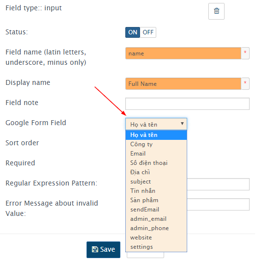
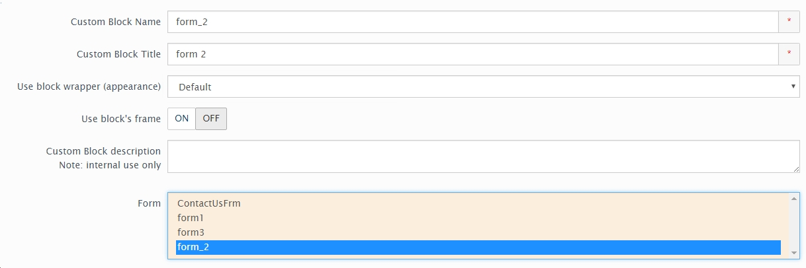
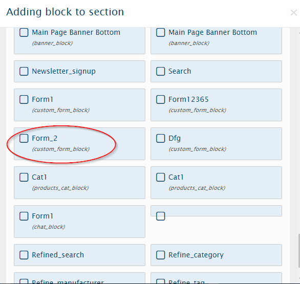

============
Sử dụng Form
============

Vinacart không giới hạn tạo form, bạn có thể tạo nhiều form theo ý muốn với mục đích sử dụng khác nhau. Tuy nhiên có một form mặc định dùng cho trang liên hệ (?rt=content/contact) tên là ``ContactUsFrm``.

Tạo Form
========

Để sửa form này, truy cập **Design > Forms Manager**, nhấn vào nút Edit ở dòng 'ContactUsFrm'. Bạn có thể thêm vài trường tùy ý với nhiều kiểu trường như text, select, checkbox..

Trong bài này mình sẽ hướng dẫn bạn cách tạo form gửi mail với google form. Trước tiên bạn chuẩn bị một google form giống như thế này https://docs.google.com/forms/d/e/1FAIpQLSd99tXc9qBuAGmIE8LgHxGMSFaScdlEJSTl_C0IcRNYbxvuRg/viewform

Lấy địa chỉ action của form bằng cách chuột phải chọn **View Page Source** tìm từ ``<form``.

.. image:: images/google-form-response.png

Copy giá trị trong thuộc tính ``action``.

Tiếp đến, bạn tạo mới form từ menu **Design > Forms Manager** nhấn nút add [+]. CHúng ta điền thông số của form như: 

- Form name: tên form, thường viết liền không có dấu cách. 
- description: mô tả cho form.
- Processing Controller: chọn 'Google Form'
- Success page: xóa đi.

Hoàn tất nhấn nút Save.
Chú ý: sau khi lưu form bạn sẽ thấy trường ``Success page`` tự động điền giá trị ``forms_manager/ticket/success`` đây là controller sử lý trang thành công bạn không được xóa đi và có thêm một trường 'Google Form Response URL' tại đây bạn điền địa chỉ google form vừa copy ở bước trên. Điền và nhấn Save lại lần nữa.

Để kiểm tra form có hoạt động, nhấn vào nút **Check google form** và nút **View form**

Bước quan trọng tiếp theo, chúng ta sẽ gán trường google form tương ứng vào trường của form. Để thêm trường mới bạn nhấn nút [+], điền các thông tin sau:

- Field type: input, textarea,...
- Display name: tên hiển thị
- Field name: tên trường, không chứa dấu cách chỉ cho phép chữ cái, số và dấu _

Nhấn Save, bạn sẽ thấy xuất hiện trường 'Google Form Field', trường này liệt kê danh sách các trường có trong Google form bạn chọn một trường tương ứng với field này.

Sau khi đã thêm đầy đủ các trường của form và gán tương ứng với trường google form, chúng ta để ý có 5 trường đặc biệt khác: ``sendEmail``, ``admin_email``, ``admin_phone``, ``website``, ``settings``.

Quan trọng: các trường này bạn sẽ tạo thêm 5 trường với kiểu trường ``hidden``. Hướng dẫn: tạo trường mới, mục 'Field type' chọn 'hidden', mục 'Display name' để dấu cách và mục 'Field name' điền tên trường đặc biệt ở trên.

Chèn form vào layout
====================

Để form hiển thị trên website, bạn cần chèn vào layout. Trước tiên bạn sẽ tạo block cho form này. Truy cập **Design > Blocks**, nhấn add [+] chọn 'Custom Forms Block'.

Ở mục Form chọn trường bạn muốn sử dụng.

Cuối cùng, thêm block này vào layout, bạn vào menu **Design > Layout**.

Chúc bạn thành công !