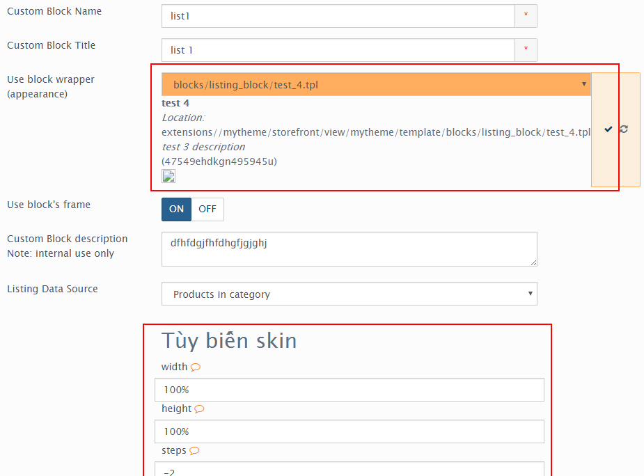

=====================
Sử dụng layout blocks
=====================

Danh sách blocks bạn có thể sử dụng:

- customer
- menu
- search
- language
- currency
- cart
- category
- breadcrumbs
- account
- newsletter_signup
- credit_cards

- special
- featured
- bestsellers

- chat_block
- html_block
- custom_form_block
- banner_block
- listing_block
  ..

Tùy chỉnh giao diện block
=========================

Hiện tại áp dụng cho 2 block ``listing_data`` & ``banner_block``. Tùy chỉnh giao diện block cho phép chúng ta đưa thêm trường vào trang edit block và sử dụng các thư viện jquery theo ý muốn.

Chúng tôi đưa sẵn các thư viện javascript đáp ứng nhu cầu làm theme phong phú, để nạp một thư viện nào đó bạn chỉ cần khai báo bởi tên. Điều này tránh trùng lặp thư viện bạn chèn vào site.

Mỗi file .tpl có một file cấu hình cùng tên có định dạng .xml và nằm cùng thư mục với file template .tpl đó. VD: ta có file ``blocks/listing_block/main_categories.tpl`` tương ứng với file cấu hình ``blocks/listing_block/main_categories.xml``

::

	<?xml version="1.0" encoding="UTF-8"?>
	<block_config>
	    <name>test 4</name>
	    <description><![CDATA[test 3 description]]></description>
	    <author><![CDATA[Hoang]]></author>

	    <preview><![CDATA[images/test.jpg]]></preview><!-- inside image folder -->
	    <help><![CDATA[Help content]]></help>

	    <!-- options, inherit from extension configuration file -->
	    <options>
	        <item name="field-1">
	            <type>selectbox</type>
	            <title><![CDATA[test_4-field1]]></title>
	            <desc><![CDATA[4e9750345urjglflfhfghf;e057435]]></desc>
	            <attributes><![CDATA[style="border:1px solid red"]]></attributes>
	            <default_value>bestsellers</default_value>
	            <variants>
	                <_AI_>bestsellers</_AI_>
	                <_AI_>latest</_AI_>
	                <_AI_>specials</_AI_>
	                <_AI_>featured</_AI_>
	            </variants>
	        </item>
	        <item name="field-2">
	            <type>checkbox</type>
	            <default_value>0</default_value>
	        </item>
			...
	    </options>

	    <!-- theme setting -->
	    <settings>
	        <item>
	            <type>js_libs</type>
	            <data>
	                <_AI_><![CDATA[marquee/endless-div-scroll]]></_AI_>
	            </data>
	        </item>

	        <item>
	            <type>styles</type>
	            <data>
	                <_AI_><![CDATA[style.css]]>]</_AI_>
	            </data>
	        </item>
	        <item>
	            <type>scripts</type>
	            <data>
	                <_AI_><![CDATA[js.js]]>]</_AI_>
	            </data>
	        </item>

	    </settings>
	</block_config>

Thẻ ``<name``, ``<description``, ``<author``, ``<preview``, ``<help`` hiển thị thông tin về block template. Ở trang sửa nội dung block, bạn sẽ nhìn thấy thông tin giao diện được tìm thấy.

Assets
======

Khai báo sử dụng thêm .css, .js và thư viện javascript khi block được load trong site. Bạn viết trong thẻ ``<scripts``.

::

	<!-- theme setting -->
	<settings>
		<item>
			<type>js_libs</type>
			<data>
				<_AI_><![CDATA[marquee/endless-div-scroll]]></_AI_>
			</data>
		</item>

		<item>
			<type>styles</type>
			<data>
				<_AI_><![CDATA[style.css]]>]</_AI_>
			</data>
		</item>
		<item>
			<type>scripts</type>
			<data>
				<_AI_><![CDATA[js.js]]>]</_AI_>
			</data>
		</item>

	</settings>

Chú ý: đường dẫn file tương tự như file cấu hình theme `theme.xml <theme-config.html>`_
Một số thư viện hay sử dụng:

- Background effects:

  - ``bg-effects/snow``
  - ``bg-effects/FireWorksNewYear``

- Galleries

  - ``galleries/jgallery``
  - ``galleries/photor``
  - ...

Tương tự, nếu bạn muốn bổ xung file của thư viện, khai báo đầy đủ như sau:
::
	
	<item>
		<type>js_libs</type>
		<data>
			<_AI_>
				<param name="name"><![CDATA[sliders/nivoSlider]]></param>
				<!-- mỗi file cách nhau dấu | -->
                <param name="styles"><![CDATA[light.css]]></param>
			</_AI_>
		</data>
	</item>

Options
=======

Để đưa thêm option cho block, bạn khai báo trong thẻ ``<options``.

::

	<options>
		<item name="f1">
			<type>selectbox</type>
			<title><![CDATA[test_4-field1]]></title>
			<desc><![CDATA[4e9750345urjglflfhfghf;e057435]]></desc>
			<attributes><![CDATA[style="border:1px solid red"]]></attributes>
			<default_value>bestsellers</default_value>
			<variants>
				<_AI_>bestsellers</_AI_>
				<_AI_>latest</_AI_>
				<_AI_>specials</_AI_>
				<_AI_>featured</_AI_>
			</variants>
		</item>
		<item name="f2">
			<type>checkbox</type>
			<default_value>0</default_value>
		</item>
		<item name="f3">
			<type>input</type>
	        <default_value><![CDATA[.next]]></default_value>
		</item>
	</options>

Nếu bạn khai báo sử dụng thư viện, các thư viện có thể có thêm options sẽ được bổ xung vào các trường bạn đã khai báo ở trên. Chú ý: chỉ lấy options của thư viện đầu tiên.

**Sử dụng trong .tpl**

Giá trị options bạn lưu với block, lưu trong biến ``$options``. Chẳng hạn bạn có thể sử dụng options để tùy chỉnh thư viện jquery.

*PHP*:

.. code-block:: php

	

*Template engine*:

.. code-block:: php

	

