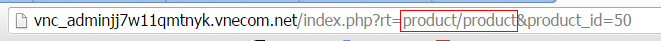
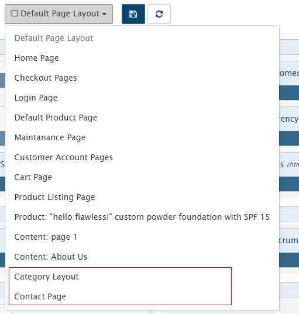

==========================================
Theme Configuration
==========================================

The configuration file of the theme allows you to customize the look & feel shown on the every pages, as well as declare the necessary assets (.js, .css) files used in the pages.
In addition, you can customize the display layout separately for specific pages and adjust the position of the blocks.

You can edit in ``storefront/view/<theme>/config/theme.xml``
Example:

::

    <?xml version="1.0" encoding="UTF-8"?>
	<theme>
		<assets>
			<file type="css"><![CDATA[https://fonts.googleapis.com/css?family=Lato:400,700,300]]></file>

			<file type="css"><![CDATA[/assets/css/bootstrap.min.css]]></file>

			<!-- global styles -->
			<file type="js" bottom="1"><![CDATA[/mytheme/themes/js/jquery.scrolltotop.js]]></file>

			<file type="js" bottom="1"><![CDATA[/javascript/bootstrap.min.js]]></file>
			<file type="js" bottom="1"><![CDATA[/assets/js/wow.min.js]]></file>

			<!-- fancybox js
			============================================ -->
			<file type="js" bottom="1"><![CDATA[/assets/js/fancybox/jquery.fancybox.pack.js]]></file>

			<!-- main JS
			============================================ -->
			<file type="js" bottom="1"><![CDATA[/assets/js/main.js]]></file>

			<file type="js" bottom="1"><![CDATA[/javascript/respond.min.js]]></file>
			<file type="js" bottom="1"><![CDATA[/javascript/jquery.validate.js]]></file>
			<file type="js" bottom="1"><![CDATA[/javascript/jquery.carouFredSel-6.1.0-packed.js]]></file>
			<file type="js" bottom="1"><![CDATA[/javascript/jquery.mousewheel.min.js]]></file>
			<file type="js" bottom="1"><![CDATA[/javascript/jquery.touchSwipe.min.js]]></file>
			<file type="js" bottom="1"><![CDATA[/javascript/jquery.ba-throttle-debounce.min.js]]></file>
			<file type="js" bottom="1"><![CDATA[/javascript/jquery.onebyone.min.js]]></file>
			<file type="js" bottom="1"><![CDATA[/javascript/custom.js]]></file>
			<!-- library -->
			<file type="lib"><![CDATA[sliders/bxslider]]></file>
		</assets>
		<assets page="index/home">

		</assets>
		<assets page="about_us">
			<!-- <file type="css" ><![CDATA[]]></file> --><!-- page="index/home" -->
			<!-- <file type="js" bottom="1"><![CDATA[]]></file> --><!-- `buttom` attribute only for js file -->
		</assets>

		<templates>
			<!-- custom templates page -->
		</templates>

		<!-- layout -->
		<layout>
			<!-- custom layouts -->
		</layout>
		<!-- blocks -->
		<blocks>
			<!-- custom blocks -->
		</blocks>
	</theme>

Configuration
=============

::
	
	<?xml version="1.0" encoding="UTF-8"?>
	<theme>
		<!-- configuration -->
	    <configuration>
	        <item name="version" value="1.2"/>
	        <item name="sample_data" value="thoitrang"/>
	        <item name="name" value="mytheme"/>
	        <item name="image_product_width_small" value="100"/>
	        <item name="image_product_height_small" value="95"/>
	    </configuration>

Declare the configuration information in the `` <configuration`` tag such as version, sample_data, name .. Explain:
- version: Abantecart version
- sample_data: sample data for the theme. List demo data: fashion, travel,...(But any string you want, Be careful not contain space character & include UTF-8 characters).
- name: theme directory.

See below for a detailed explanation of how to use the configuration.

Settings
========

This section will update all Abantecart settings that are saved in the databases. On the administration interface, to edit these settings you visit at ``?rt=setting/setting/all`` . Since each theme's configuration value may vary depending on the theme that is customized accordingly, instead of directly editing in the admin you can edit those values directly in the theme.xml file.

::

	<?xml version="1.0" encoding="UTF-8"?>
	<theme>
		<settings>
	        <item name="config_storefront_api_status" value="1"/>
	        <item name="config_admin_api_status" value="0"/>
	        <item name="storefront_width" value="80%"/>
	    </settings>
	</theme>

You can declare variable inside ``<configuration`` tag.

::

	<?xml version="1.0" encoding="UTF-8"?>
	<theme>
		<configuration>
	        <item name="image_product_width_small" value="100"/>
	        <item name="image_product_height_small" value="95"/>
	    </configuration>
		<settings>
	        <item name="config_image_product_height" value="image_product_height_small"/>
	    </settings>
	</theme>

The above method would be useful when exporting / importing a theme.

Assets
======

Register asset files include .js and .css used in your theme in assets tag ``<assets``.

::

	<assets>
	    <file type="css"><![CDATA[https://fonts.googleapis.com/css?family=Lato:400,700,300]]></file>
		<file type="css" media="all"><![CDATA[/asset/css/style.css]]></file>
		<file type="js" bottom="1"><![CDATA[/javascript/bootstrap.min.js]]></file>
	</assets>

type attribute tell your type of asset, e.g ``type="css"`` for .css, If the file you want to load at the bottom of the page you add ``bottom="1"`` to ``<file`` tag Otherwise, they are displayed by default in the tag ``<head`` (`button` attribute only apply to js file). 

For css files, you can add attribute ``media``, By declaring the add attribute ``media``. ex: *media="all"*

For simplicity and ease of orginazation, I put all of the theme's assets into a `` assets`` directory located at `` storefront/view/<theme_name>/``. Note: The path is started in the theme folder.

You should not delete files locate in  ``/javascript``, ``/stylesheet``
Besides, we can include external URLs such as jquery, ... google fonts.

**Asset (Path)**

The files contained in the theme are started in the ``storefront/view/<theme_name>/`` directory, and the URL begins with a ``/ `` like the following:

::

	<file type="css"><![CDATA[/assets/style.css]]></file>

**Load asset on specific page**

Sometimes you just want to load .css, js files at certain pages to avoid loading unnecessary files for the purpose of speeding up website display. For example, the image gallery is only used in the detailed product page, so you declare more the `<assets` tag as follows.

::

	<assets page="product/product">
		<file type="css" bottom="0"><![CDATA[/assets/custom-slider/css/nivo-slider.css]]></file>        
		<file type="css" bottom="0"><![CDATA[/assets/custom-slider/css/preview.css]]></file>        

		<!-- Nivo slider js
		============================================ -->
		<file type="js" bottom="1"><![CDATA[/assets/custom-slider/js/jquery.nivo.slider.js]]></file>
		<file type="js" bottom="1"><![CDATA[/assets/custom-slider/home.js]]></file>
	</assets>

The ``page`` attribute contains the page address (controller address). e.g: ``storefront/controller/blocks/banner_block.php`` The page address will be ``blocks/banner_block`` . The address is the ``rt`` parameter when you view the site, which can be found by viewing a product page.

Note: by default does not enable SEO Url mode, so you can debug.
You can declare more ``assets`` tag if you wish, assets tag without the ``page`` attribute will load on every page.

You can also specify ``page`` with the seo url name (alias). Ex: We have a about page: http://your-domain/about_us

::

	<assets page="about_us">
		<file type="css" ><![CDATA[/assets/css/file1.css]]></file> --><!-- page="index/home" -->
		<file type="js" bottom="1"><![CDATA[/assets/js/file1.js]]></file> --><!-- `buttom` attribute only for js file -->
	</assets>

**Load assets depend on the context**

For js/css/lib files you want to use for some blocks used, eg quickview.css is only inserted into the page when displaying the product listing. This case does not specify a page, which can be applied to multiple pages. See the example below:

::

	<assets context="productsListing=1">
        <file type="css" ><![CDATA[/asset/css/quick_view_popup.css]]></file>
        <file type="lib" ><![CDATA[zoom/cloud-zoom]]></file>
    </assets>

In the above example we use the ``context`` attribute instead of the ``page`` attribute. Note: do not use both properties at the same time.

Thư viện
^^^^^^^^

Vinacart built-in popular javascript/jquery libraries. For the sake of convenience, some libraries include multiple css & js files, which are difficult to manage when inserting files, and some libraries if you insert manually so they can using the same files that are duplicated. So the easiest way is to use the default library of vinacart (Note: you can also declare more libraries, if you want in your theme).

Example: for bootstrap library.
::

	<file type="lib">
        <param name="name"><![CDATA[ui/bootstrap]]></param>
    </file>

By default it loads the files: bootstrap.min.css, bootstrap.min.js

all js libraries declare in core/load-js-libs.php.

You also write briefly as follows:
::
	
	<file type="lib"><![CDATA[ui/bootstrap]]></file>

However, the case if the library has added some files (eg additional files for that library) is not loaded by default. Eg: nivoSlider has many different skins. We fully declare the above syntax and add the file name you want to load, each separated by ``|``:
::

	<file type="lib">
        <param name="name"><![CDATA[sliders/nivoSlider]]></param>
        <param name="styles"><![CDATA[light.css]]></param>
    </file>

For example: loading jQuery plugins:
::

	<file type="lib">
        <param name="name"><![CDATA[jquery-libs]]></param>
        <param name="scripts"><![CDATA[jquery.mousewheel.min.js|jquery.touchSwipe.min.js|jquery.ba-throttle-debounce.min.js]]></param>
    </file>

To add a library, you write to the file ``core/config/library.php``
::

	<?php
	return array(
	    'menu/smartmenus' => array(
	        'scripts'=> array(
	            'jquery.smartmenus.min.js'=> array(
	                'file'=> 'jquery.smartmenus.min.js',
	                'required'=> 1,
	                'bottom'=> 1
	            ),
	            'jquery.smartmenus.bootstrap.js'=> array(
	                'file' => 'addons/bootstrap/jquery.smartmenus.bootstrap.min.js',
	                'required'=> 1,
	                'bottom'=> 1
	            )
	        ),
	        'styles'=> array(
	            'sm-core-css.css'=> array(
	                'file'=> 'css/sm-core-css.css',
	                'required'=> 1
	            ),
	            'jquery.smartmenus.bootstrap.css' => array(
	                'file'=> 'addons/bootstrap/jquery.smartmenus.bootstrap.css',
	                'required'=> 1
	            ),
	            'sm-blue.css'=> array(
	                'file'=> 'css/sm-blue/sm-blue.css',
	                'required'=> 0
	            ),
	            'sm-clean.css' => array(
	                'file'=> 'css/sm-clean/sm-clean.css',
	                'required'=> 1
	            ),
	            'sm-mint' => array(
	                'file'=> 'css/sm-mint/sm-mint.css',
	                'required'=> 0
	            ),
	            'sm-simple' => array(
	                'file'=> 'css/sm-simple/sm-simple.css',
	                'required'=> 0
	            )
	        )
	    )
	);

Templates
=========

By default all pages will load in ``common/page.tpl`` so you will design all page in this file, but if you want to be more flexible by writing templates for different pages into Different files, we will declare more templates to the `` <templates`` tag.

::

	<templates>
		<!-- alway use short path -->
		<page context="index/home" template="common/page-home.tpl"></page>
		<!-- <page context="index/maintenance" template="common/page-maintenance.tpl"></page> -->
		<page context="content/contact" template="common/page-contact.tpl"></page>
		<page context="content/content" args="content_id=1" template="common/page-aboutus.tpl"></page>
		<page context="product/product"  template="common/page-product.tpl"></page>
		<page context="product/category"  template="common/page-category.tpl"></page>
		<page context="product/manufacturer"  template="common/page-category.tpl"></page>
		<page context="product/search"  template="common/page-category.tpl"></page>
		<page context="product/special"  template="common/page-category.tpl"></page>

	</templates>

Each page has a separate template declared in the ``<page`` tag, the page address by the ``context`` attribute, and the .tpl address in the ``template`` directory of the theme, declared with ``template`` attribute.

In the case the page address (controller) has many child pages, eg: contact page: ``content/contact`` when sent successfully will go to the ``content/contact/success`` page. This page has not been declared above so use the default template page.tpl to display it. We will use sample file for  ``content/contact`` like this:

::
	
	<page context="content/contact/success" template="common/page-contact.tpl"></page>

Alternatively, you can also set up using the same template with the content/contact page by adding ``child_pages="1"``:

::
	
	<page context="content/contact" child_pages="1" template="common/page-contact.tpl"></page>

This will apply the page-contact.tpl template to every child page from the 'content/contact' address.

**Filter page by parameter**

You can also use multiple templates for a page, by filtering the URL parameters. In the above example, the page ``content/content`` will display the page content with *id=1*, declaring the ``content_id`` parameter on the ``args`` property.

::

	<page context="content/content" args="content_id=1" template="common/page-aboutus.tpl"></page>

If more than one parameter, the parameters separated by ``&`` Ex: `arg1=value1&arg2=value2`
Write each new template (.tpl), you need to declare it in ``<custom_templates``.

::

	<custom_templates>
		<tpl><![CDATA[common/page-home.tpl]]></tpl>
		<tpl><![CDATA[common/page-contact.tpl]]></tpl>
		<tpl><![CDATA[common/page-product.tpl]]></tpl>
		<tpl><![CDATA[common/page-category.tpl]]></tpl>
	    ...
	</custom_templates>

Layout
======

Abantecart has some of the default layout templates:

- Default Page Layout
- Home Page
- Checkout Pages
- Login Page
- Default Product Page
- Maintenance Page
- Customer Account Pages
- Cart Page
- Product Listing Page.

In addition, vinacart allows you to add a layout to the specific category/product/content page, if you want to customize the layout.
However, customizing all layouts will not be allowed in the admin interface.

For example, the contact page you want to add the map block will not be, you can not manipulate the admin ui and need to declare more layout for the page to change the blocks data.
Write to the theme configuration file (theme.xml) with the following content:

::

	<layout>
		<page name="Category Layout" context="product/category" default="1">
			<apply context="product/manufacturer" />
		</page>
		<page name="Contact Page" context="content/contact" default="1">
			
		</page>
	</layout>

Arguments:

- ``name`` - layout name.
- ``context`` - page address.

Other parameters leave default.
If you want to apply a layout to other pages, declare the ``<apply`` like the above.

Blocks
======

There are two types of blocks:

- parent block: includes ``header``, ``header_bottom``, ``column_left``, ``column_right``, ``content_top``, ``content_bottom``
- child block: These are the child blocks contained in the parent block. Ex: latest, bestsellers, account,..

Abantecart restricts child blocks to display in parent blocks. Ex, block *bestsellers* by default only nest in ``column_left``, ``column_right``, ``content_bottom``.

However, you can expand the display of blocks at other parent block to facilitate the development of the theme. To do this, you declare the ``<blocks`` tag. See the example below:

::

	<blocks>
		<block>
			<!-- example of overriding block -->
			<block_txt_id><![CDATA[bestsellers]]></block_txt_id>
			<controller>blocks/bestseller</controller>
			<templates>
				<__AUTO_INCREASE__>
					<parent_block_txt_id><![CDATA[footer_top]]></parent_block_txt_id>
					<template><![CDATA[blocks/bestseller.tpl]]></template>
				</__AUTO_INCREASE__>
				<__AUTO_INCREASE__>
					<parent_block_txt_id><![CDATA[header_bottom]]></parent_block_txt_id>
					<template><![CDATA[blocks/bestseller_home.tpl]]></template>                    
				</__AUTO_INCREASE__>
				<__AUTO_INCREASE__>
					<parent_block_txt_id><![CDATA[column_left]]></parent_block_txt_id>
					<template><![CDATA[blocks/bestseller.tpl]]></template>
				</__AUTO_INCREASE__>
				<__AUTO_INCREASE__>
					<parent_block_txt_id><![CDATA[content_bottom]]></parent_block_txt_id>
					<template><![CDATA[blocks/bestseller_home.tpl]]></template>
				</__AUTO_INCREASE__>
				<__AUTO_INCREASE__>
					<parent_block_txt_id><![CDATA[column_right]]></parent_block_txt_id>
					<template><![CDATA[blocks/bestseller.tpl]]></template>
				</__AUTO_INCREASE__>

			</templates>
			<custom_templates>
				<__AUTO_INCREASE__>
					<parent_block_txt_id><![CDATA[footer_top]]></parent_block_txt_id>
					<template><![CDATA[blocks/bestseller.tpl]]></template>
					<page valueAsAttrs="1" context="content/content" args="content_id=1"></page>
				</__AUTO_INCREASE__>
				<__AUTO_INCREASE__>
					<parent_block_txt_id><![CDATA[header_bottom]]></parent_block_txt_id>
					<template><![CDATA[blocks/bestseller_home.tpl]]></template>                    
				</__AUTO_INCREASE__>
			</custom_templates>
		</block>
	</blocks>

*Explain*:

- ``block_txt_id`` - block txt id.
- ``controller`` -  controller of block.
- ``templates`` - Declare the parent block and the default template of the block displayed at that parent block, in each pair of tags ``<__AUTO_INCREASE__``.
- ``custom_templates`` - Declare your own templates in addition to the default block template here (not required).

In order for this block to take effect, you will reload the configuration by visiting **System > VNC Framework > Tools** and click **Refresh Blocks**

Ok, go back to the layout page in admin, select the layout in the list you will see the new layout.

Block Settings
^^^^^^^^^^^^^^

All the blocks will use the same vinacart configuration you set up (at Admin URL: /index.php?rt=setting/setting/all).
Sometimes some blocks will need to change the value, such as the bestseller block, latest in the left column (column_left), suppose that image size according to the theme design is smaller than the product display in the home page, Products.

This image size is determined by the configuration *config_image_product_width*, *config_image_product_height*. You can easily change this parameter to apply to parent block & child block, like this:
::

	<blocks>
		<!-- apply to parent blocks -->
		<block>
			<block_txt_id><![CDATA[column_left]]></block_txt_id>
			<controller>common/column_left</controller>
			
			<config>
				<param name="config_image_product_width"><![CDATA[100]]></param>
				<param name="config_image_product_height"><![CDATA[95]]></param>
			</config>
		</block>
		<!-- apply for block -->
		<block>
            <block_txt_id><![CDATA[latest]]></block_txt_id>
            <controller>blocks/latest</controller>
            
            <config>
                <param name="config_image_product_width"><![CDATA[product_small_image_width]]></param>
                <param name="config_image_product_height"><![CDATA[product_small_image_height]]></param>
            </config>
		</block>

	</blocks>

Note: With each size created will create new images corresponding to that size, so be careful to avoid redundancy. If you use multiple times values configure the best way to set variables to avoid writing the wrong value.
::

	<configuration>
        <item name="image_product_width_small" value="100"/>
        <item name="image_product_height_small" value="95"/>
    </configuration>
	<block>
		..
		<config>
	        <param name="config_image_product_width"><![CDATA[image_product_width_small]]></param>
	        <param name="config_image_product_height"><![CDATA[image_product_height_small]]></param>
	    </config>
	</block>

You can also change the setting value in each parent position, by declaring the value in the ``<skin>`` tag.

::
	<skin>
        <_AI_>
            <name><![CDATA[sb_flat]]></name>
            <position><![CDATA[content_bottom]]></position>
            <config>
                <param name="blog_entry_image_width"><![CDATA[blog_entry_image_width]]></param>
                <param name="blog_entry_image_height"><![CDATA[blog_entry_image_height]]></param>
            </config>
        </_AI_>
        <_AI_>
            <name><![CDATA[sb]]></name>
            <position><![CDATA[column_left]]></position>
            <config>
                <param name="blog_entry_image_width"><![CDATA[blog_entry_small_image_width]]></param>
                <param name="blog_entry_image_height"><![CDATA[blog_entry_small_image_height]]></param>
            </config>
        </_AI_>
    </skin>

See more block skin below.

Block Skin
^^^^^^^^^^

Inherit almost all current cms like wordpress, you can declare the sidebar params easily with vinacart. Set up in the configuration file (``theme.xml``)

Declare the skins used for the theme:
::

	<block_skins>
        <skin name="skin1">
            <param name="before_title"><![CDATA[
<h2>]]></param>
            <param name="after_title"><![CDATA[</h2>
]]></param>
            <param name="before_widget"><![CDATA[
]]></param>
            <param name="after_widget"><![CDATA[
]]></param>
        </skin>
        <skin name="sidebar">
            <param name="before_title"><![CDATA[<h3 class="%2$s">]]></param>
            <param name="after_title"><![CDATA[</h3>]]></param>
            <param name="before_widget"><![CDATA[
]]></param>
            <param name="after_widget"><![CDATA[
]]></param>
        </skin>

        <skin name="footer">
            <param name="before_title"><![CDATA[<h3 class="%2$s">]]></param>
            <param name="after_title"><![CDATA[</h3>]]></param>
            <param name="before_widget"><![CDATA[
]]></param>
            <param name="after_widget"><![CDATA[
]]></param>
        </skin>
        <skin name="blog_sidebar">
            <param name="before_title"><![CDATA[<h3 class="%2$s">]]></param>
            <param name="after_title"><![CDATA[</h3>]]></param>
            <param name="before_widget"><![CDATA[
]]></param>
            <param name="after_widget"><![CDATA[
]]></param>
        </skin>
    </block_skins>

Apply skin to parent block.

::

	<blocks>
		<block>
			<block_txt_id><![CDATA[header]]></block_txt_id>
			<controller>common/header</controller>
			<skin>
				<name><![CDATA[skin1]]></name>
				<values>
					<param name="before_title"><![CDATA[block1]]></param>
					<param name="before_widget"><![CDATA[block_1]]></param>
				</values>
			</skin>
		</block>
		<block>
			<block_txt_id><![CDATA[column_left]]></block_txt_id>
			<controller>common/column_left</controller>
			<skin>
				<name><![CDATA[sidebar]]></name>
				<values>
					<param name="before_title"><![CDATA[block1]]></param>
					<param name="before_widget"><![CDATA[block_1]]></param>
				</values>
			</skin>
			<config>
				<param name="config_image_product_width"><![CDATA[100]]></param>
				<param name="config_image_product_height"><![CDATA[95]]></param>
			</config>
		</block>
		<block>
			<block_txt_id><![CDATA[column_right]]></block_txt_id>
			<controller>common/column_right</controller>
			<skin>
				<name><![CDATA[blog_sidebar]]></name>
				<values>
					<param name="before_title"><![CDATA[block1]]></param>
					<param name="before_widget"><![CDATA[block_1]]></param>
				</values>
			</skin>
		</block>
		..
	</blocks>

Note: values of variable ``before_title``, ``after_title`` with ``<param`` tag Corresponds to the placeholder ``%2$s``.

In the .tpl file to display the skin we have template variables:
::

	{{before_widget}}
		..
		{{ before_title}}{{ heading_title }} {{ after_title}}
		..
	{{after_widget}}

When placing blocks in two different positions they all show up in a file, eg: bestseller block in column_left & column_right both calls in bestseller.tpl. In this case you can also use two different templates for a block at different parent and declare multiple skins. We will change skin with multiple parent block, as follows:

::

	<skin>
		<_AI_>
			<name><![CDATA[sb]]></name>
			<position><![CDATA[column_left]]></position>
			<template><![CDATA[blocks/bestseller_slides.tpl]]></template>
			<values>
				<param name="before_title"><![CDATA[]]></param>
				<param name="before_widget"><![CDATA[special-product best-sale-product]]></param>
			</values>
		</_AI_>
		<_AI_ >
			<name><![CDATA[sb_flat]]></name>
			<position><![CDATA[column_right]]></position>
			<template><![CDATA[blocks/bestseller.tpl]]></template>
			<values>
				<param name="before_title"><![CDATA[]]></param>
				<param name="before_widget"><![CDATA[special-product new-product]]></param>
			</values>
		</_AI_>
	</skin>

Note: ``<_AI_>`` stand for ``<__AUTO_INCREASE__>``

Image Configuration
===================

- config_image_thumb_width|	config_image_thumb_height

	+ thumb image for product page.

- config_image_popup_width|	config_image_popup_height
	
	+ (listing_block) main image with media resource type for current object in page.
	+ main image for product page.

- config_image_product_width|config_image_product_height
	
	+ thumb image used in block: bestseller, featured, latest, special, listing_block (for product).
	+ thumb for products listing in category|manufacturer|search|special page

- config_image_additional_width|config_image_additional_height
	
	+ thumb image in block cart
	+ additional thumb images in product page.

- config_image_related_width|config_image_related_height
	
	+ main image for related products in product page.

- config_image_cart_width|config_image_cart_height
	
	+ list product in account page: cart, download, invoice, wishlist, confirm, guest_step_3

- config_image_grid_width|config_image_grid_height
	
	+ block manufacturer
	+ image in manufacturer page.
	+ list manufacturer images in product page.
	+ (admin) in all grid list with image support.

- config_image_category_width|config_image_category_height

	+ block category, listing_block (for category)
	+ list subcategories in category page.

- config_image_manufacturer_width|config_image_manufacturer_height

	+ listing_block (for manufacturer)

*Conclusion*: 

blocks: cart, category, bestseller (featured, latest, special), listing_block, manufacturer
pages: 
	single product
	products listing page (category|manufacturer..)
	account pages (cart, download, invoice, wishlist, confirm, guest_step_3)
