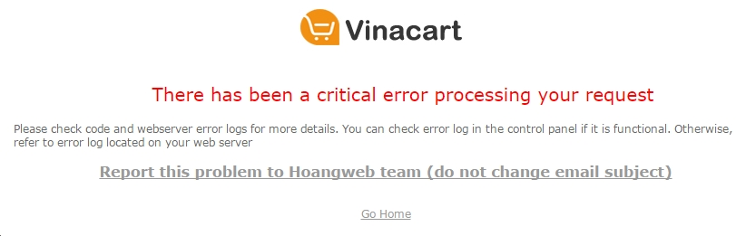
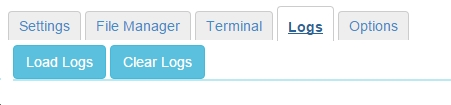
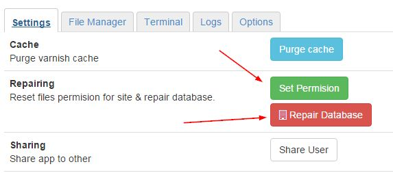

==========================
Sửa lỗi
==========================

**Lỗi không xem được nội dung website**

Nếu gặp lỗi khi sử dụng trang web, bạn sẽ nhìn thấy trang lỗi xuất hiện trường hợp này chúng ta vào xem lịch sử logs của site, tại địa chỉ: http://vnecom.net:3000/vinacart/apps/{APP_ID}
Chuyển sag tab logs và nhấn vào nút **load logs**

Nguyên nhân:

- Thiết lập permission của Files không đúng, chẳng hạn trong quá trình chúng tôi cập nhập dữ liệu và code có thể phát sinh lỗi này. Để thiết lập lại permission, rất đơn giản bạn quay trở lại tab `Settings` và nhấn vào nút **Set permission**.
- Do lỗi truy cập mysql, trường hợp này khi view log bạn sẽ thấy thông báo không truy cập được bảng trong database (permission deny). Khi thấy lỗi CSDL chúng ta có thể sửa lại quyền truy cập tới CSDL bằng cách nhấn vào nút `Repair Database`.

**Reset admin password**

Trường hợp quên mật khẩu, để reset lại tài khoản admin bạn cần mã bí mật lưu ở file ``system/logs/auth_pass.txt`` sau đó truy cập URL: ``?rt=vnc/cli/user/reset_admin?pass=123456&gen_token=<secret>``
